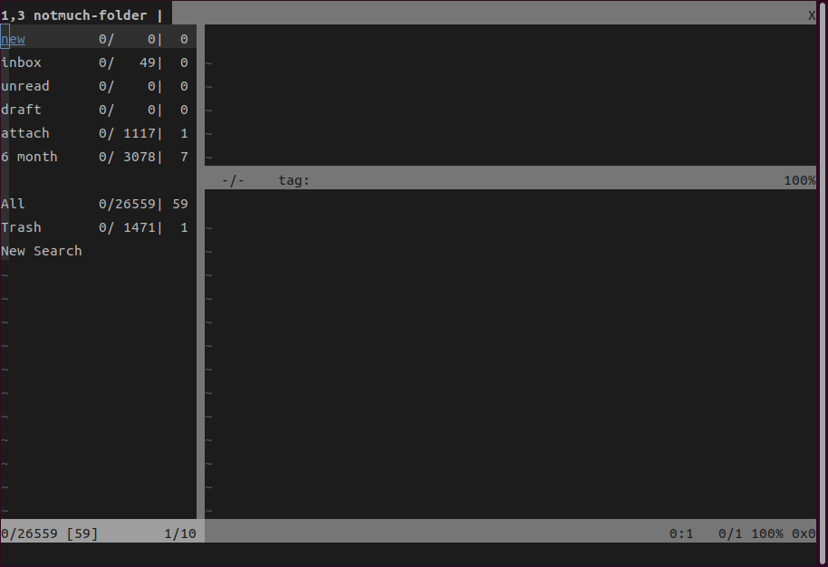

# notmuch-python-vim

## 概要

notmuch-python-vim は [Notmuch](https://notmuchmail.org/) と連携して、メールの読み書きを手助けする

Notmuch には元々送受信機能がないので、送信には sendmail 等、受信には fetchmail 等のプログラムが別途必要

同種のプラグインとしては、[notmuch-vim](https://github.com/felipec/notmuch-vim) が有るが、自分の使いたい機能がなかったので作成

### 欠点

メール数が多い検索条件だとスレッド一覧の表示に時間がかかる

* Ubuntu 23.10
* Linux kernel 6.5.0
* VIM - Vi IMproved 9.0
* CPU: 12th Gen Intel© Core™ i7-1270P×16
* Memory: 32&nbsp;GB

の環境で、約 28000 通にヒットする検索条件のスレッド一覧の表示に 18 秒ほど

個人的には今の所、普段は 3 ヶ月以内のメールのみ一覧するように検索条件を指定している

タグの操作で複数指定をできるようにしたため、通常 Vim では | (バー) で区切ると複数個のコマンド指定ができるが、それができない

## 要件

### Vim

````sh
vim --version | grep +python3
````

他には +folding 等も必要だが、調べきれていない

#### Notmuch

Notmuch をセットアップし、

````sh
notmuch new
````

でデータベースを作成しておく必要が有る

Notmuch が動作条件なので、対応しているメール・ボックスの種類は Maildir, MH のいずれかになる

#### Python Ver.3.x

加えて Python Ver.3 の notmuch2, html2text パッケージが必要

Ubuntu 等の Debian 系なら

````sh
sudo apt install -y python3-notmuch2 python3-html2text
````

他では

````sh
python3 -m pip install notmuch2 html2text
````

#### MTA

メール送信には、別途 sendmail 等の MTA とその設定が必要

## インストール

使用しているパッケージ・マネージャに従えば良い

### [Vundle](https://github.com/gmarik/vundle)

````vim
Plug 'iranoan/notmuch-py-vim'
````

### [Vim-Plug](https://github.com/junegunn/vim-plug)

````vim
Plug 'iranoan/notmuch-py-vim'
````

### [NeoBundle](https://github.com/Shougo/neobundle.vim)

````vim
NeoBundle 'iranoan/notmuch-py-vim'
````

### [dein.nvim](https://github.com/Shougo/dein.vim)

````vim
call dein#add('iranoan/notmuch-py-vim')
````

### Vim packadd

````sh
git clone https://github.com/iranoan/notmuch-py-vim ~/.vim/pack/iranoan/start/notmuch-py-vim
````

遅延読み込みをさせるなら

````sh
git clone https://github.com/iranoan/notmuch-py-vim ~/.vim/pack/iranoan/opt/notmuch-py-vim
````

~/.vim/vimrc などの設定ファイルにに次のような記載を加える

````vim
augroup loadNotmuchPy
  autocmd!
  autocmd CmdUndefined Notmuch packadd notmuch-py-vim
augroup END
````

## 使用方法

次のように起動する

````sh
vim +'Notmuch start'
````

Vim 起動後なら

````vim
:Notmuch start
````

### デフォルト・レイアウト

デフォルトでは

````vim
:Notmuch start
````

で次のレイアウトで起動する

<table style='border: solid thin; float: left'>
<tr>
  <td rowspan=2 style='border: solid thin;'><em><strong>F-WIN</strong></em></td>
  <td style='border: solid thin;'><em><strong>T-WIN</strong></em></td>
</tr>
<tr><td style='border: solid thin;'><em><strong>S-WIN</strong></em></td></tr>
</table>



### デフォルト環境の主な使用法

***&lt;F1&gt;*** でデフォルト・キーマップを表示

上の ***F-WIN***, ***T-WIN***, ***S-WIN*** の意味と操作法ははそれぞれ次のとおり

***F-WIN***

* 擬似的なメール・フォルダのフォルダー・ツリー
* **o** で ***T-WIN*** にメール一覧を表示
* `:bwipeout` すると他の ***T-WIN***, ***S-WIN*** や未編集の送信バッファも閉じられる

***T-WIN***

* スレッド・ツリー
* デフォルトでは全体の 1/4 程度の高さ
* ***S-WIN*** のウィンドウが有れば、カーソル位置のメールを ***S-WIN*** に表示する
* **o** でスレッド開閉
* ステータス・バーにタグなどの情報を表示
* zn を無効にしている

***S-WIN***

* まず先頭に設定にしたがってヘッダを表示する
* それに続いて、text/plain パートも有る HTML メールなら
  > HTML: index.html

  が表示される
* さらに添付ファイルが有る時などに
  > Attach: file\_name.zip

  等の追加情報が表示される
* どちらも
  * **o** で開く
  * 削除されていれば、HTML:→Del-HTML:, Attach:→Del-Attach: と表示
* これらのヘッダの後に本文が続き、text/plain と text/html パートの両方が含まれている時は、text/plain の後の
  > HTML part

  に続いてプレイン・テキストに変換した text/html パートが折り畳まれた状態で表示される

* text/html しか無いメールの場合、折り畳まれずに表示される

***c*** 新規メール

***r*** 返信メール

***R*** 転送メール

**&lt;Space&gt;** で未読メールを読み進める

**&lt;Tab&gt;** でウィンドウを ***F-WIN*** → ***T-WIN*** → ***S-WIN*** とサイクリックに切り替え

**&lt;S-Tab&gt;** でウィンドウを ***F-WIN*** → ***S-WIN*** → ***T-WIN*** とサイクリックに切り替え

### 送信メール

送信メールに
> From:  
> To:  
> Cc:  
> Bcc:  
> Subject:  
> Reply-To:  
> Attach:

のような内容において、Attach ヘッダはバーチャル・ヘッダで、添付ファイルをパスで指定する

Attach ヘッダを追加すれば、添付ファイルを複数付けられる

本文部分にカーソルが移動すると

* From 等ヘッダ
* 署名

が入力される

空でない Fcc: ヘッダが有れば送信後にメールをそこに保存する

***&lt;Leader&gt;s*** でバッファをメール送信
